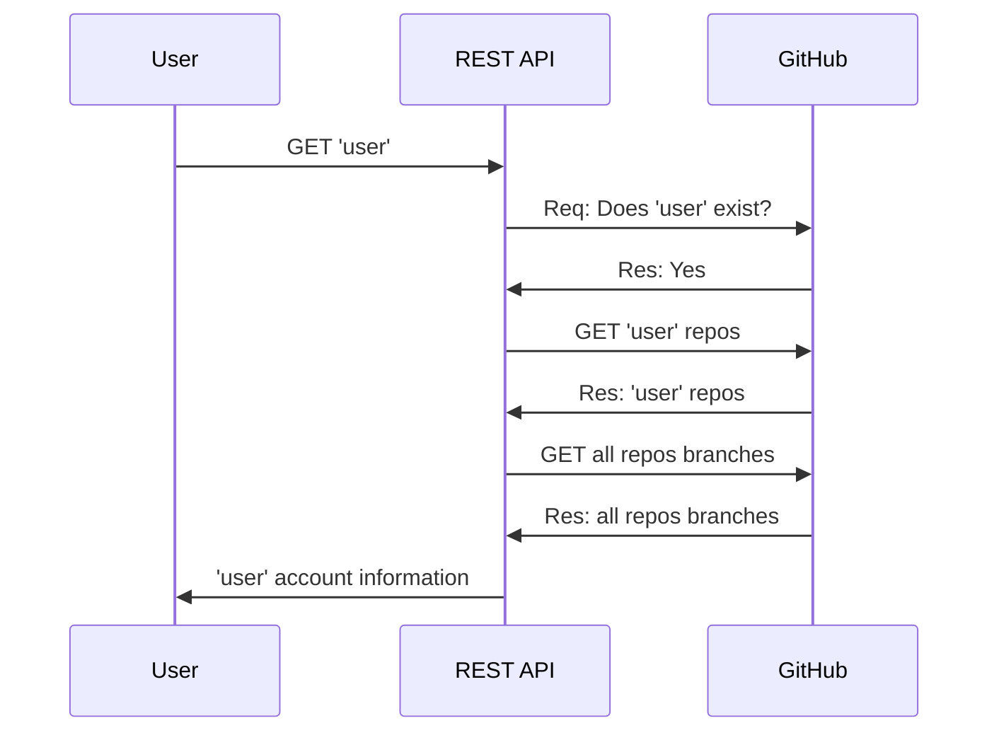

<div>
	<div style="text-align: center;"><h1>Atipera recruitment project 🍐</h1></div>
	<div style="text-align: center;"><p>REST API that gives you basic information about GitHub accounts</p></div>
</div>

## Introduction
Thank you for invitation to recruitment process! This project has been created according to the guidelines given in the task description.

## Installation
For this project to work you will need:
- Your favourite IDE,
- Web browser / API platform e.g. Postman

Now you can run project in few simple steps:
```bash
$ git clone https://github.com/MemeeMaster/atipera-recruitment
$ cd atipera-recruitment
```

## Usage / How it works
This project will give you basic information about GitHub account specified in request body. By sending request you will retrieve:
- User login,
- User repositories which are not forks,
- Repository branches

**How it works**:
Simply, when you send a request to the API, it forwards it to the GitHub API to check if the specified user exists. If so, a request is sent to retrieve a list of the user's repositories. This response is filtered to remove fork repositories.

Requests are then sent for the branches of each of these repositories. It is very easy to exceed GitHub's query limit so for the full experience, I recommend using the app for small/medium accounts.

**Example graph without errors:**



## Endpoints
`/api/repositories` - **GET** method that will fetch user details from GitHub REST API. (username, repositories, branches). For this endpoint to work you will need to provide valid body and **'Accept'** header. The `application/json`header is required. Otherwise, the application will throw an error.

**Example request:**
```
Method: GET
URL: http://localhost:8080/api/repositories
Headers:
	'Accept': 'application/json'

Body:
{
	"username": "User_login"
}
```

**Example response:**
```json
{
	"login":  "User_login",
	"repositories":  [
		{
			"name":  "Repository name",
			"branches":  [
				{
					"name":  "Branch name",
					"lastCommitSha":  "5ab8572d41a7aee7a004c99bda1a1b807363c9d2"
				}
			]
		}
	]
}
```

For now there is only one endpoint, but application is easily scalable.

## Common problems
1. User Not Found
```json
{
	"status":  404,
	"Message":  "User not found."
}
```
If your answer looks like this, you most likely typed the username incorrectly. Please check again if the name is correct, and if not please get back to me and I will try to help you out.

2. Wrong Header
```json
{
	"status":  406,
	"Message":  "'Accept' header format is not acceptable. Please, provide 'application/json' instead."
}
```
For this kind of exception, you most likely passed the wrong 'Accept' header. Please check if your header is set to `application/json`.

3. Bad Request
```json
{
	"status":  400,
	"error":  "Bad Request",
}
```
You most likely forgot to forward the body to your request. Please check if your body isn't empty.

4. Forbidden
```json
{
	"status":  403,
	"error":  "Forbidden",
}
```
This project does not use any validation so the lock comes from the GitHub API. Most likely your IP was blocked due to a very high number of requests.

## Credits
Technologies used in this project:
- Java 17,
- [Spring Boot 3](https://spring.io/projects/spring-boot),
- [WebFlux library](https://docs.spring.io/spring-framework/reference/web/webflux.html),
- [Project Lombok](https://projectlombok.org/)
- [GitHub REST API](https://developer.github.com/v3)

## Thanks / Contact
Thank you for the oppourtunity to build this awesome project! If you found it interesting, feel free to contact me via [GitHub](https://github.com/MemeeMaster) or [mail](mailto:j@wronski.cloud) 👋


